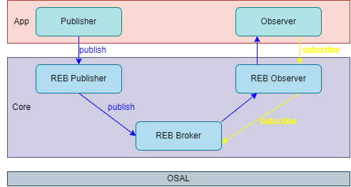
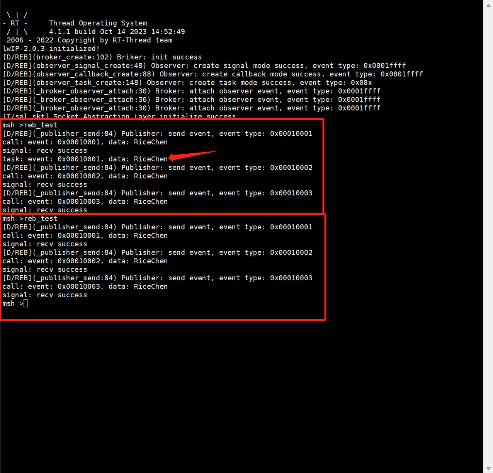

# REB
REB(Rice Event Broker)全称事件代理，REB框架采用设计模式中的观察者模式，它可以使我们的代码能够高度解耦，可扩展。

## 观察者模式

聊REB之前，我们聊聊观察者模式带给我们特性，他能对我们框架设计提供什么好处。

##### 什么是观察者模式

- 观察者模式(Observer Pattern)是一种行为设计模式，用于定义对象之间的一对多依赖关系，使得一个对象的状态变化会通知其所有依赖者并自动更新它们的状态。这个模式涉及两种主要类型的对象：

    1. 被观察者：也称为主题或可观察者，是一个对象，它维护一组观察者（或依赖者）并提供方法来添加、删除和通知这些观察者。当被观察者的状态发生变化时，它会通知所有已注册的观察者。
    2. 观察者：观察者是依赖于被观察者的对象，它们实现一个接口或抽象类，包含一个更新方法（通常称为update），用于接收并处理被观察者的状态变化通知。

##### 观察者模式工作流程
- 被观察者注册观察者：被观察者维护一个观察者列表，并提供注册（添加）和注销（删除）观察者的方法。
- 被观察者状态变化：当被观察者的状态发生变化，它会遍历其观察者列表，调用每个观察者的更新方法，将状态变化通知给它们。
- 观察者响应：每个观察者在接收到通知后会执行自己的更新逻辑，以响应被观察者的状态变化。

##### 观察者模式优势
- **解耦性：**观察者模式可以帮助降低对象之间的耦合度。被观察者和观察者之间的关系是松散的，它们可以独立演化，而不会影响彼此的具体实现。
- **可扩展性：**你可以轻松地添加新的观察者，而不需要修改被观察者的代码。这种扩展性使你能够动态地增加或删除观察者，以满足不同的需求。
- **通知机制：**观察者模式允许被观察者通知观察者，从而使观察者能够在适当的时候进行响应。这可以帮助确保数据的一致性，因为观察者会立即知道被观察者的状态变化。
- **分布式事件处理：**观察者模式常用于实现分布式事件处理系统，其中多个观察者可以远程订阅和接收事件通知。
- **可重用性：**观察者模式可以在不同的应用中重复使用，因为它是一个通用的设计模式，不受特定应用领域的限制。
- **灵活性：**观察者模式可以用于许多不同的场景，如用户界面更新、事件处理、数据同步等，使得代码更加灵活和可维护。
- **支持一对多关系：**观察者模式支持一对多的依赖关系，这意味着一个被观察者可以同时通知多个观察者，从而实现多个对象之间的协同工作。

##### 观察者模式例子

- 物联网协议MQTT：MQTT（Message Queuing Telemetry Transport，消息队列遥测传输协议），是一种基于发布/订阅（publish/subscribe）模式的“轻量级”通讯协议。
- Android的EventBus：EventBus是一个基于发布者/订阅者模式的事件总线框架。

## REB框架设计

##### REB框架图



##### REB框架说明

1. REB框架分为3层：osal(OS抽象层)，REB核心层(包含发布者，观察者，中间人)，应用层(调用REB的模块或应用)。
2. osal(OS抽象层)：为了能让此框架应用于不同的操作系统，且不用修改框架本省，所以提供os适配层。
3. REB核心层(包含发布者，观察者，中间人)：框架的三大角色，它们三者互相依赖。
    - publisher(发布者)：REB框架的发布者支持4种接口：默认发送接口，默认发送完释放数据内存释放接口，紧急发送接口，紧急发送完数据内存释放接口。
    - observer(观察者)：REB框架的观察者支持3种接口：信号接收接口，回调接收接口，线程接收接口。
    - broker(中间人)： REB框架的中间人支持两种接口：观察者只观察一次接口，观察者观察多次接口。
4. 应用层(调用REB的模块或应用)：上层应用或者模块，相互独立，互不依赖。
5. REB是以事件为导向，事件类型由主事件类型和次事件类型组成，事件类型占用32个位，主事件类型占高16位，次事件类型占低16位。一般：以网络为例：主事件类型为：net_type，次事件类型为：link_up，link_down等。

##### REB目录结构

```C
├─adapter
│  ├─cmsis                      
│  |   ├─reb_mutex.c            // cmsis mutex适配层
│  |   ├─reb_queue.c            // cmsis queue适配层
│  |   ├─reb_sem.c              // cmsis sem适配层
│  |   └─reb_task.c             // cmsis task适配层
│  └─rtthread                   
│      ├─reb_mutex.c            // rtthread mutex适配层
│      ├─reb_queue.c            // rtthread queue适配层
│      ├─reb_sem.c              // rtthread sem适配层
│      └─reb_task.c             // rtthread task适配层
├─example                       
│  └─reb_rtt_example.c          // rtthread 平台实例
├─include
│  ├─reb_broker.h               // reb 中间人的头文件
│  ├─reb_cfg.h                  // reb 参数配置文件
│  ├─reb_def.h                  // reb 框架通用接口定义
│  ├─reb_observer.h             // reb 观察者的头文件
│  └─reb_publisher.h            // reb 发布者的头文件
└─src
   ├─reb_broker.c               // reb 中间人的源文件
   ├─reb_publisher.c            // reb 观察者的源文件
   └─reb_observer.c             // reb 发布者的源文件
```

## REB接口说明
##### broker接口

| 接口 | 说明 |
|------|------|
| broker_create | 创建broker |
| broker_delete | 删除broker |
| broker_observer_attach_once | 关联观察者到broker中，并只观察一次 |
| broker_observer_attach | 关联观察者到broker中，并只观察多次 |
| broker_observer_detach | 从broker中脱离观察者 |

- 创建broker
    - 在使用该框架时，必须要通过此接口创建broker，它是发布者和观察的者的中间人。

``` C
reb_status broker_create(void);
```

|**参数**|**描述**|
|------|------|
| -- | -- |
|**返回**| ——  |
| REB_OK | broker创建成功 |
| REB_ERROR | broker创建失败 |

- 删除broker
    - 当不在使用该框架时，可以调用此接口删除broker。

``` C
reb_status broker_delete(void);
```

|**参数**|**描述**|
|------|------|
| -- | -- |
|**返回**| ——  |
| REB_OK | broker删除成功 |
| REB_ERROR | broker删除失败 |

- 关联观察者到broker中，并只观察一次
    - 我创建的观察者之后，需要通过此接口将观察者关联到broker中。当发布者发布事件，可以通过broker找到对用的观察者。使用该接口观察者只观察一次事件。
``` C
reb_status broker_observer_attach_once(observer_base *obs);
```

|**参数**|**描述**|
|------|------|
| obs | 观察者对象 |
|**返回**| ——  |
| REB_OK | 关联观察者到broker中，成功 |
| REB_ERROR | 关联观察者到broker中，失败 |

- 关联观察者到broker中，并只观察多次
    - 我创建的观察者之后，需要通过此接口将观察者关联到broker中。当发布者发布事件，可以通过broker找到对用的观察者。使用该接口观察者只观察多次事件。
``` C
reb_status broker_observer_attach(observer_base *obs);
```

|**参数**|**描述**|
|------|------|
| obs | 观察者对象 |
|**返回**| ——  |
| REB_OK | 关联观察者到broker中，成功 |
| REB_ERROR | 关联观察者到broker中，失败 |

- 从broker中脱离观察者

``` C
reb_status broker_observer_detach(observer_base *obs);
```

|**参数**|**描述**|
|------|------|
| obs | 观察者对象 |
|**返回**| ——  |
| REB_OK | 观察者从broker中脱离，成功 |
| REB_ERROR | 观察者从broker中脱离，失败 |

##### observer接口

| 接口 | 说明 |
|------|------|
| observer_signal_create | 创建信号模式的观察者，只接收事件信号，不传输数据的观察者 |
| observer_signal_wait | 信号模式的观察者，等待同步信号 |
| observer_callback_create | 创建回调模式的观察者 |
| observer_task_create | 创建任务模式的观察者 |
| observer_delete | 删除观察者 |

- 创建信号模式的观察者
    - 该接口是创建信号模式的观察者，它只接收事件信号，不传输数据的。

``` C
observer_base *observer_signal_create(uint16_t type, uint16_t sub_type);
```

|**参数**|**描述**|
|------|------|
| type | 观察者观察的主事件类型 |
| sub_type | 观察者观察的次事件类型 |
|**返回**| ——  |
| obs | 观察者创建成功 |
| NULL | 观察者创建失败 |

- 信号模式的观察者，等待同步信号
    - 该接口是信号模式的观察者，用户层需要通过一个任务监听观察事件的同步信号接口。

``` C
reb_status observer_signal_wait(observer_base *base, reb_time_t timeout);
```

|**参数**|**描述**|
|------|------|
| base | 观察者对象 |
| timeout | 观察事件的超时事件 |
|**返回**| ——  |
| REB_OK | 观察到对应事件 |
| OTHER | 观察失败 |

- 创建回调模式的观察者
    - 该接口是创建回调模式的观察者，当事件产生时，broker会通过回调的方式通知观察者事件的到来。
``` C
observer_base *observer_callback_create(uint16_t type,
                                        uint16_t sub_type,
                                        obs_callback_cb cb,
                                        void *arg);
```

|**参数**|**描述**|
|------|------|
| type | 观察者观察的主事件类型 |
| sub_type | 观察者观察的次事件类型 |
| cb | 事件产生时，回调的接口函数 |
| arg | 回调函数的用户数据 |
|**返回**| ——  |
| obs | 观察者创建成功 |
| NULL | 观察者创建失败 |

- 创建任务模式的观察者
    - 该接口是创建任务模式的观察者，当事件产生时，broker会通过创建一个线程，然后由独立的线程将事件通知给观察者。
``` C
observer_base *observer_task_create(uint16_t type,
                                    uint16_t sub_type,
                                    obs_task_cb run,
                                    void *arg,
                                    uint32_t stack_size,
                                    uint32_t prio);
```

|**参数**|**描述**|
|------|------|
| type | 观察者观察的主事件类型 |
| sub_type | 观察者观察的次事件类型 |
| run | 事件产生时，线程的处理函数 |
| arg | 线程处理函数的用户数据 |
| stack_size | 线程的栈空间大小 |
| prio | 线程的优先级 |
|**返回**| ——  |
| obs | 观察者创建成功 |
| NULL | 观察者创建失败 |

- 从broker中脱离观察者

``` C
reb_status observer_delete(observer_base *base);
```

|**参数**|**描述**|
|------|------|
| base | 观察者对象 |
|**返回**| ——  |
| REB_OK | 观察者删除成功 |
| REB_ERROR | 观察者删除失败 |

##### publisher接口

| 接口 | 说明 |
|------|------|
| publisher_factory_create | 创建发布者工厂 |
| publisher_send | 发布者默认发送消息 |
| publisher_send_with_free | 发布者默认发送消息，发送完成之后把消息缓冲删除 |
| publisher_urgent_send | 发布者发送紧急消息 |
| publisher_urgent_send_with_free | 发布者发送紧急消息，发送完成之后把消息缓冲删除 |

- 创建发布者工厂
    - 该接口是创建发布者工厂，提供事件队列，使发布消息处于非阻塞式发送

``` C
reb_status publisher_factory_create(pub_notify notify);
```

|**参数**|**描述**|
|------|------|
| notify | 事件通知回调，当发布者发布消息之后，通过回调通知broker |
|**返回**| ——  |
| REB_OK | 发布者工厂创建成功 |
| REB_ERROR | 发布者工厂创建失败 |

- 发布者默认发送消息
    - 该接口是发布者发布事件接口，它是采用先进先出的方式发送消息

``` C
reb_status publisher_send(uint16_t type, uint16_t sub_type,
                          uint32_t data, reb_time_t timeout);
```

|**参数**|**描述**|
|------|------|
| type | 发布消息的主事件类型 |
| sub_type | 发布消息的次事件类型 |
| data | 发布消息的数据 |
| timeout | 发布消息的超时时间 |
|**返回**| ——  |
| REB_OK | 发布消息成功 |
| OTHER | 发布消息失败 |

- 发布者默认发送消息，发送完成之后把消息缓冲删除
    - 该接口是发布者发布事件接口，它是采用先进先出的方式发送消息，并且将消息发送给所有观察者之后，数据的内存会执行释放。

``` C
reb_status publisher_send_with_free(uint16_t type, uint16_t sub_type,
                                    uint32_t data, reb_time_t timeout);
```

|**参数**|**描述**|
|------|------|
| type | 发布消息的主事件类型 |
| sub_type | 发布消息的次事件类型 |
| data | 发布消息的数据 |
| timeout | 发布消息的超时时间 |
|**返回**| ——  |
| REB_OK | 发布消息成功 |
| OTHER | 发布消息失败 |

- 发布者发送紧急消息
    - 该接口是发布者发布事件接口，它是采用插队的方式发送消息，它会将发布的消息插入消息队列的头部。
``` C
reb_status publisher_urgent_send(uint16_t type, uint16_t sub_type,
                                 uint32_t data, reb_time_t timeout);
```

|**参数**|**描述**|
|------|------|
| type | 发布消息的主事件类型 |
| sub_type | 发布消息的次事件类型 |
| data | 发布消息的数据 |
| timeout | 发布消息的超时时间 |
|**返回**| ——  |
| REB_OK | 发布消息成功 |
| OTHER | 发布消息失败 |

- 发布者发送紧急消息，发送完成之后把消息缓冲删除
    - 该接口是发布者发布事件接口，它它是采用插队的方式发送消息，它会将发布的消息插入消息队列的头部。并且将消息发送给所有观察者之后，数据的内存会执行释放。

``` C
reb_status publisher_urgent_send_with_free(uint16_t type, uint16_t sub_type,
                                           uint32_t data, reb_time_t timeout);
```

|**参数**|**描述**|
|------|------|
| type | 发布消息的主事件类型 |
| sub_type | 发布消息的次事件类型 |
| data | 发布消息的数据 |
| timeout | 发布消息的超时时间 |
|**返回**| ——  |
| REB_OK | 发布消息成功 |
| OTHER | 发布消息失败 |

## REB验证
1. 创建三个不同模式的观察者，并关联到broker中。
2. 通过多次不发布事件，查看观察者是否能接收到事件。

```
#include "rtthread.h"
#include "reb_broker.h"
#include "reb_observer.h"
#include "reb_publisher.h"

observer_base *obs_signal;
observer_base *obs_call;
observer_base *obs_task;

void sig_thread_handle(void *arg)                                           // 信号模式观察者监听同步信号
{
    while(1) {
        if(observer_signal_wait(obs_signal, RT_WAITING_FOREVER) == REB_OK) {
            rt_kprintf("signal: recv success\r\n");        
        }
    }
}

void obs_callback(uint32_t event, uint32_t data, void *arg)                 // 回调模式观察者处理函数 
{
    rt_kprintf("call: event: 0x%08x, data: %s\r\n", event, (char *)data);
}

void obs_task_fun(uint32_t event, uint32_t data, void *arg)                 // 任务模式观察者任务处理函数 
{
    rt_kprintf("task: event: 0x%08x, data: %s\r\n", event, (char *)data);
}

int reb_init(void)
{
    rt_thread_t signal_thread = NULL;

    broker_create();                                                                        // broker创建

    obs_signal = observer_signal_create(1, REB_ALL_MINOR_TYPE);                             // 创建信号模式观察者

    signal_thread = rt_thread_create("sig_thread", sig_thread_handle, NULL, 1024, 10, 20);  // 创建线程，等待信号模式下的事件
    rt_thread_startup(signal_thread);

    obs_call = observer_callback_create(1, REB_ALL_MINOR_TYPE, obs_callback, NULL);         // 创建回调模式观察者

    obs_task = observer_task_create(1, REB_ALL_MINOR_TYPE, obs_task_fun, NULL, 1024, 15);   // 创建任务模式观察者

    broker_observer_attach(obs_signal);                                                     // 关联信号模式观察者
    broker_observer_attach(obs_call);                                                       // 关联回调模式观察者
    broker_observer_attach_once(obs_task);                                                  // 关联任务模式观察者

    return RT_EOK;
}
INIT_COMPONENT_EXPORT(reb_init);

int reb_test(void)
{
    char *data = "RiceChen";
    publisher_send(1, 1, (int)data, 1000);          // 发布事件
    publisher_send(1, 2, (int)data, 1000);          // 发布事件
    publisher_send(1, 3, (int)data, 1000);          // 发布事件
}
MSH_CMD_EXPORT(reb_test, Rice Event broker test);
```

